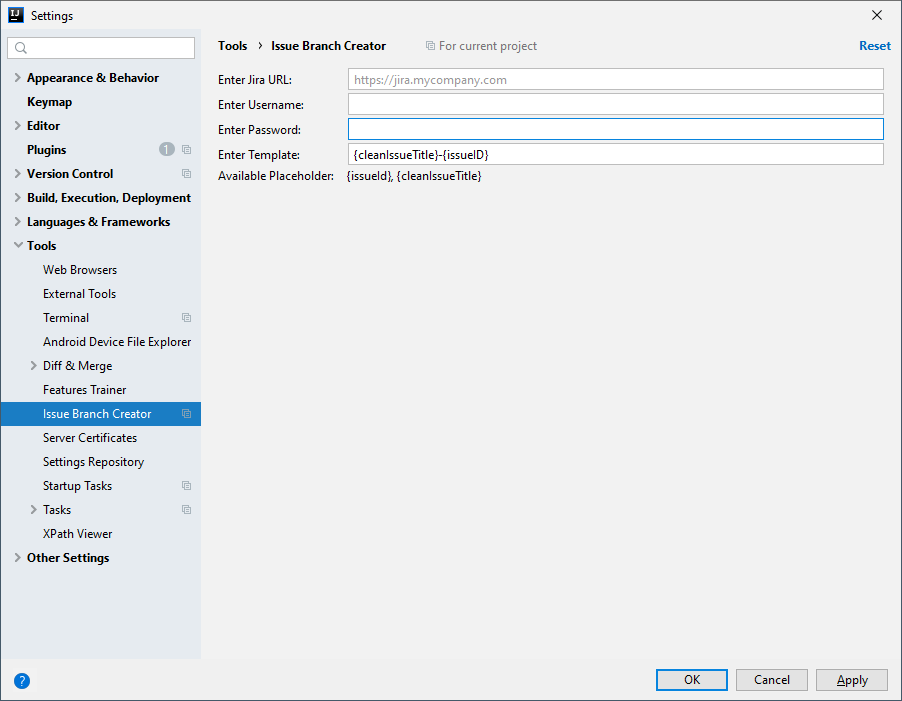

  

# issue branch creator

<!-- Plugin description -->
Simplifies git branch creation with the name of a JIRA issue.
<!-- Plugin description end -->

Default Shortcut: <kbd>Ctrl</kbd>+<kbd>G</kbd>,<kbd>C</kbd>

## Screenshots

Enter your issue Id

Check the suggested branch name

Profit 💰

**Available Settings**

